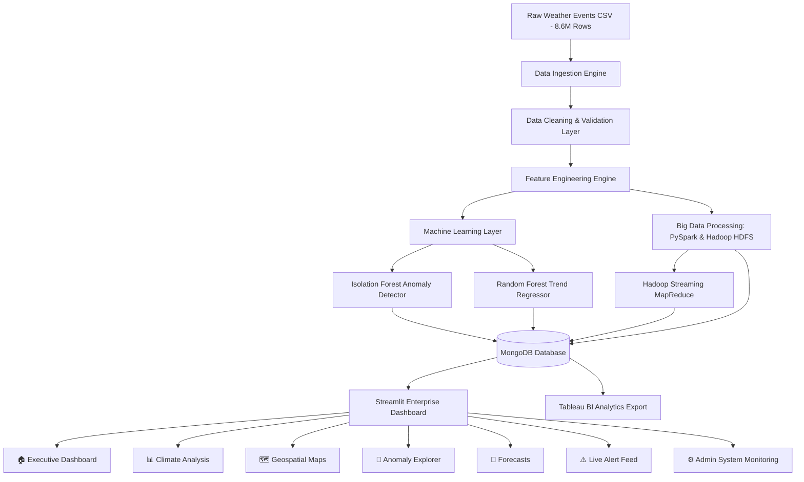
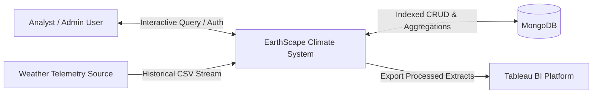
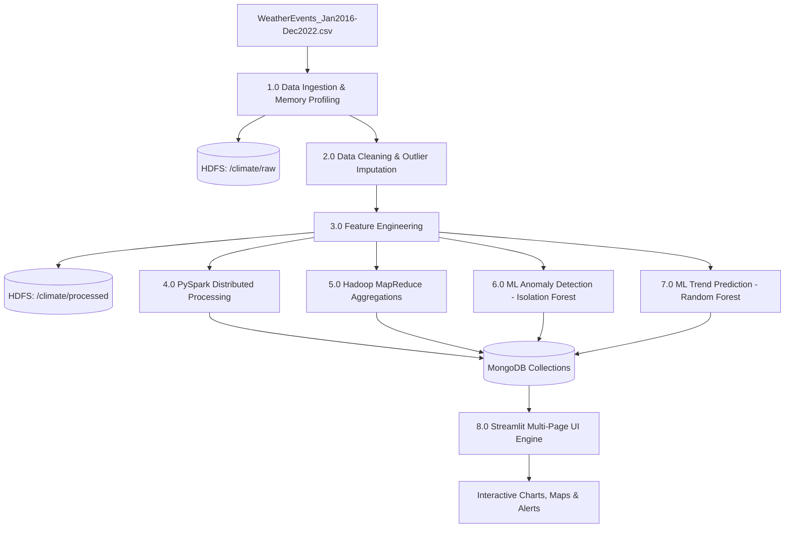
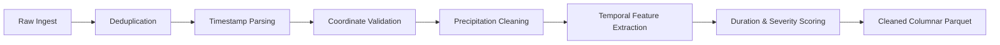
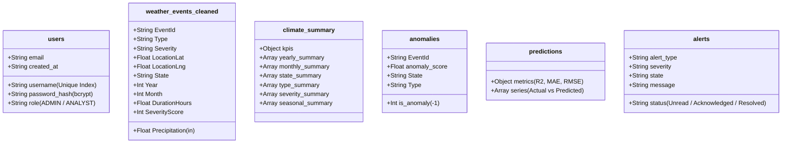
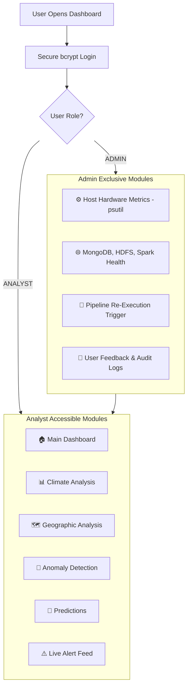

# EarthScape Climate Agency — System Architecture & Diagrams

## 1. High-Level Architecture Overview

EarthScape Climate Agency is a unified Big Data, Machine Learning, and Climate Analytics platform built 100% on the Python data science stack without any JavaScript frontend frameworks.



---

## 2. Comprehensive System Architecture Diagrams

### Diagram 1: Data Flow Diagram (DFD) — Level 0 (Context Diagram)



---

### Diagram 2: Data Flow Diagram (DFD) — Level 1 (Detailed Flow)



---

### Diagram 3: Data Processing Workflow



---

### Diagram 4: Machine Learning Workflow

```mermaid
flowchart TD
    subgraph Isolation_Forest_Pipeline
        A1[Clean Feature Vector: Lat, Lng, Precip, Duration, SeverityScore] --> A2[StandardScaler Normalization]
        A2 --> A3[IsolationForest 150 Estimators]
        A3 --> A4[Output: is_anomaly -1 vs 1, Decision Score]
        A4 --> A5[MongoDB 'anomalies' Collection]
    end
    
    subgraph Random_Forest_Forecasting_Pipeline
        B1[Monthly Event Count Aggregations] --> B2[Lag Feature Generation: Lag1, Lag2, Lag12, RollingMean]
        B2 --> B3[80/20 Chronological Train/Test Split]
        B3 --> B4[RandomForestRegressor Training]
        B4 --> B5[Evaluation: R2, MAE, RMSE]
        B5 --> B6[MongoDB 'predictions' Collection]
    end
```



---

### Diagram 5: MongoDB Schema & Collection Architecture



---

### Diagram 6: Hadoop HDFS Directory Architecture

```
/climate/
├── raw/
│   └── WeatherEvents_Jan2016-Dec2022.csv      # Unmodified primary historical dataset
├── processed/
│   ├── cleaned_weather_events.parquet         # Columnar cleaned telemetry
│   └── pyspark_climate_summary.parquet        # Distributed Spark aggregations
├── ml/
│   ├── isolation_forest.joblib                # Trained anomaly detection model
│   └── random_forest_regressor.joblib         # Trained climate trend regressor
└── output/
    └── state_events_summary/                  # MapReduce state event counts
        ├── _SUCCESS
        └── part-00000
```

---

### Diagram 7: Streamlit Dashboard Navigation & Role Workflow



---

### Diagram 8: Real-Time Telemetry Simulation Stream

```mermaid
flowchart LR
    A[APScheduler Trigger - Every 15s] --> B[Generate Realistic Weather Telemetry]
    B --> C[Validate Bounds & Format]
    C --> D[Evaluate Isolation Forest Anomaly Score]
    D --> E[Check Alert Rules: Severe / High Precip / Anomaly]
    E --> F[Persist to MongoDB Collections]
    F --> G[Streamlit UI Reactive Refresh (DEMO/SIMULATED)]
```
